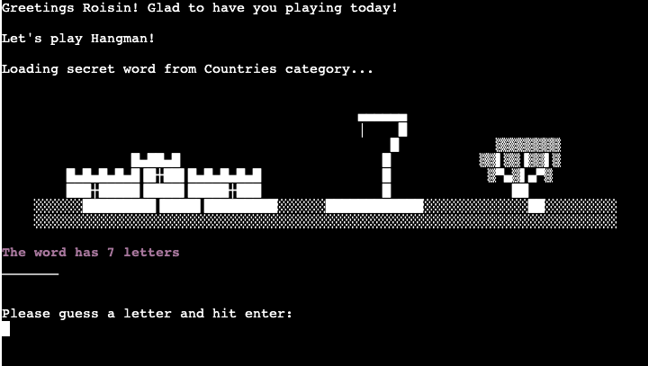
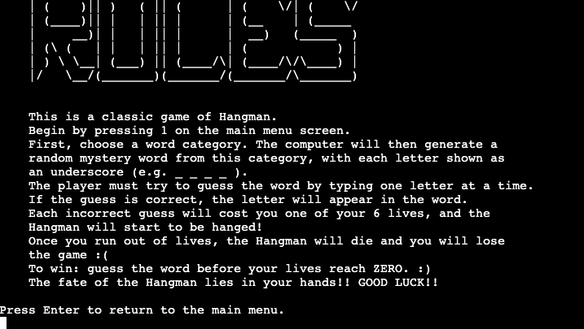

# Hangman Python Game

## Developer: Róisín O'Connell 


[View the live project here](https://hangman-roc-9218949e7f7b.herokuapp.com/)

[View GitHub repository](https://github.com/roc-11/hangman)

## Introduction
Hangman is a Python-based terminal game, which runs in the [Code Institute](https://codeinstitute.net/ie/ "Link to Code Institute homepage") mock terminal on [Heroku](https://www.heroku.com/ "Link to Heroku hompepage"). This project enables users to guess letters in order to reveal the mystery word. Words are categorized into different categories which users can select from. Users can make up to 6 incorrect guesses. Visual feedback is provided to users via ASCII Hangman illustrations for incorrect guesses.

The game was made for the third of five Milestone Projects required to complete the Diploma in Full Stack Software Development (e-Commerce Applications) program at [Code institute](https://codeinstitute.net/ie/ "Link to Code Institute homepage").

The main requirements of this project are to build a command-line application that is useful and usable, and allows users to manage a common dataset about a particular domain.

## How To Play Hangman
Hangman is a word guessing game where a player tries to reveal a hidden word by suggesting individual letters. And incorrect guess results in a piece of a hangman figure being drawn, while correct guesses reveal the guessed letter's position. You can read more about the Hangman game in general [here](https://www.wikihow.com/Play-Hangman).

# How to Play PYTHON HANGMAN

1. Click this []ink](https://hangman-roc-9218949e7f7b.herokuapp.com/) to take you to the mock terminal.
2. Once the page is loaded, click 'RUN PROGRAM'.
3. Get familiar with the program - entering 2 to learn the rules of the game. 
4. Begin a Hangman game by inputting 2 on the main menu. 
5. Select a word category and input your username. Now you are ready to play!
6. A secret word will generated. A message will appear clarifying how many letters are in the word, and each letter will be shown with a "_".
7. Start guessing letters, one at a time. Each correct letter guess reveals its position in the word! :) 
8. Careful now! And incorrect guess will lose you a life and a piece of the Hangman will be hanged/drawn. :( 
9. If you correctly guess all the letters before you lose your lives - then CONGRATS YOU WIN!! The word has been revealed and you've saved the Hangman!
If you lose all 6 lives - the SORRY YOU LOSE!! The Hangman is hanged. The mystery word will be revealed. 
10. Choose if you would like to play again or not.

[Back to top ⇧](#hangman-python-game)

## UX

### Planning Stage

#### Aim
The aim of this project is to build a Python-based Hangman game, which is fun and accessible to users, handles errors and is easy for users to navigate through the instructions. Users will play the game via a mock terminal on [Heroku](https://www.heroku.com/ "Link to Heroku hompepage").

#### Application Goals
* To provide users with a terminal-based game of Hangman which they can play.
* To produce a Python-based Hangman game which both challenges and entertains users.
* To create an environment and rules that are easily interpreted and accessible for users.
* To implement error and exception handling to provide users with useful and informative feedback, and make for a better, more functional game experience.
* To meet the [user goals](#user-goalsstories)

#### User Goals/Stories

New Users
- As a new site user, I would like to read the rules/instructions, so that I can learn how to play and understand the game correctly.
- As a new site user, I would like to have fun and be challenged, so that I can enjoy playing the game.
- As a new site user, I would like a variety of word categories, so that I can replay the game many times.
- As a new site user, I would like to know how many guesses I have left when playing, so that I can be more tactical and careful with my guesses.
- As a new site user, I would like feedback after my guess, so that I can adjust my game strategy.
- As a new site user, I would like to be able to play again, so that I can improve my skills.

Returning Users
- As a returning site user, I would like to I would like to read the rules/instructions, so that I can remember how to play correctly.
- As a returning site user, I would like to to have fun and be challenged, so that I can enjoy playing the game.
- As a returning site user, I would like to a variety of word categories, so that I can replay the games and experience new words each time I play.
- As a returning site user, I would like feedback after my guess, so that I can adjust my game strategy.
- As a returning site user, I would like to be able to play again, so that I can improve my skills.

### User Feedback

Feedback is provided to users throughout the application. The [Colorama](https://pypi.org/project/colorama/) library is utilised to improve this feedback. Most of the gameplay and instructions are in the default white text, against the terminal black background. In order to provide more eye-catching and clear user feedback, error messages, invalid entry messages, incorrect guesses and win/loss feedback all appear in different colours. 

The colours are standardised across the app for consistency: 
- blue text/background: error messages, invalid entries
- red text/background: loss of life, incorrect guess, lose the game
- green text/background: correct guess, win the game
- magenta text/background: number of letters in the mystery word
- cyan: number of lives/tries/guesses left in the game

In order to make the Python code more readable, the `Colorama` output code is defined in variables at the top of the file, after the `Colorama` is initialized. `Autoreset` is set to TRUE so that text is reset after each use of `Colorama` text output. 

```py
from colorama import Fore, Back, Style, init

init(autoreset=True)

color_blue = Back.BLUE
color_red = Fore.RED+Style.BRIGHT
color_green = Fore.GREEN+Style.BRIGHT
color_cyan = Fore.CYAN+Style.BRIGHT
color_magenta = Fore.MAGENTA+Style.BRIGHT
```

### Flow Chart

To follow best practice, a flowchart was created for the app's logic, and mapped out before coding began using a free version of
[Lucidchart](https://www.lucidchart.com/pages/ER-diagram-symbols-and-meaning).

Below is the flowchart of the main process of this Python program. It shows the entire cycle of the program. The left shows the initial intended project flowchart, and the right shows the final project flowchart.

| Initial | Final |
| --- | --- |
|  |  |

### Google Sheets

I made use of Google Sheets in order to store the data for the Python Hangman game. The sheet "words" contains all the possible game words, with one category stored in each column (countries, sports, zoo animals, fruit, capital cities (Europe), Harry Potter, Pokémon). These are easily scalable and extendable by adding to the Google Sheet document.

The second sheet "scores" was set up in the beginnig of the program to store all of the user_names and scores saved. This would in turn enable the creation of a leaderboard option on the main menu. The [future implementations](#features-to-implement-in-the-future) section of this file provides more information on how, due to time constraints, this proved to be outside the scope of the project. 

You can view the Google Sheet by clicking [here](https://docs.google.com/spreadsheets/d/1E8oiWccbxZau_ZdFplxTz3HfzBVmHai4kuNfuKxWTEg/edit#gid=0).

[Back to top ⇧](#hangman-python-game)

## Features

### Main Menu

When a user launches the game, the main menu will be shown. A large ASCII Hangman Title is shown as well as some fun artwork. 
The user has 3 options to choose from on this first screen:
1. Play Game
2. Game Rules
3. Exit

User input is needed to proceed. The user can select 1, 2 or 3 and hit enter to proceed. 
The `main_menu()` function contains the code which deals with this initial screen. The list:

```py
    valid_menu_selection = ['1', '2', '3']
```

is used to validate the user's selection. A selection entered outside of this list, e.g. 5 or "f", would result in an error message "INVALID CHOICE! Sorry, option not allowed." In this case, the user is again prompted to input a valid choice 1, 2, or 3. 


[Back to top ⇧](#hangman-python-game)

### Play Hangman

Selecting 1 from the main menu will begin the Hangman game. Three functions are run in this case:
1. get_rand_word()
2. welcome()
3. play_hangman(word)

The code will generate random word, show welcome, then play hangman. These will be further explained below. 

#### Category Selection & Generate Random, Mystery Word

The first part of playing the Hangman game involves a users being prompted to select a word category. There are 7 categories to choose from for this Hangman game. These are Countries, Sports, Zoo Animals, Fruit, Capital Cities (Europe), Harry Potter and Pokémon. 

In order to ensure a valid category is selected, there is a list: 

```py
    valid_category = ["1", "2", "3", "4", "5", "6", "7"]
```

A while loop runs which prompts the user to select a category from the above list, input it and press enter. This input is stored as `category`. The while loop checks the value stored in `category`. If a valid number from the `valid_category` list is entered, the `words_list` variable is changed accordingly. There is a column for each category in `words_list` stored in the "words" sheet in [Google Sheets Spreadsheets](https://docs.google.com/spreadsheets/d/1E8oiWccbxZau_ZdFplxTz3HfzBVmHai4kuNfuKxWTEg/edit#gid=0). Once a valid option is chosen, the loop is exited in order to proceed to generating a random word. 

The [Python random library](https://docs.python.org/3/library/random.html) is used to generate a random choice from the `words_list`. This random word is assigned to the variable `random_word`. The random word is then converted to a string with `str()` and made uppercase with `.upper()`. Finally, non-aphanumeric characters are removed from the random word string. (SEE BUGS FOR MORE DETAILS ON THIS)

```py
#return random word as string, remove non-alphanumeric characters

    word_to_string = str(random_word).upper()
    word_remove_non_alpha = filter(str.isalpha,word_to_string)
    word="".join(word_remove_non_alpha)

    return word
```

There is a defence included in case of an incorrect or invalid entry from the user. Anything entered which is not in the `valid_category` list will result in an error message in blue text appearing. The user will be again prompted to input a valid category selection. 

```py
    elif category not in valid_category:
        print(f"{color_blue}Sorry, that is not a valid selection.")
        print(f"{color_blue}Only number 1 - 7 allowed.")
        time.sleep(2)  # delay message
        continue
```


[Back to top ⇧](#hangman-python-game)

#### Input Username

After a valid category is selected, the screen is cleared and there is a loading message, to delay all information appearing to the user at once. The [Python time library](https://docs.python.org/3/library/time.html) is imported at the top of the run.py file so that the `sleep()` function can be used throughout the game to delay/pause user feedback. 

The category the user selected is clarified. The user is then prompted to input their username. The reason for this is twofold:
* to provide a more personalised user experience (e.g. Congrats Colin!).
* initial plans included being able to save scores to Google Sheets. This turned out to be beyond the scope of this project.

The username prompt runs in a `while True:` loop. The `player_name` is returned and stored in the global variable `player_name` upon entering a valid username. 

Validation code is included here to prevent users entering 0 or an empty string. 
```py
if len(player_name) == 0 or player_name == "":
    print(f"{color_blue}Sorry, you must enter a username!")
    continue
```
There is additional validation code to catch the error of a user entering a username which is non-alphabetic. 
```py
elif not player_name.isalpha():
    print(f"{color_blue}Sorry, your name must be letters ONLY!")
    continue
```

The while loop runs until a valid username is entered and the user hits enter. 


[Back to top ⇧](#hangman-python-game)

#### Hangman Game Play Screen

The main Hangman game play screen begins with a friendly greeting message, personalised to the user (using the username entered on previous screen). This is followed by a "let's play Hangman" message. A message then appears informing the user that the secret word is loading from the `category` chosen for this round of game play. The user is also given information such as the number of letters in the mystery word.



Some variables are initialised at the beginning of play. Dashes are used to display the secret/mystery word to the user. The number of dashes is determined by the length of `word` (the variable generated by the `get_rand_word()` function. `word_length` stores the length of the mystery word so that a message is shown to make clear to the user how many letters are in the current mystery word. Upon load the user hasn't made any guesses yet, so `guessed` is set to 'False' and an empty array is declared to store the letters the user guesses during gameplay (`guessed_letters`). Finally, a user begins with 6 `tries` or lives. They have 6 lives to use, or incorrect guesses to make, before the Hangman is hanged. 

```py
    word_completion = "_" * len(word)
    word_length = len(word)
    guessed = False
    guessed_letters = []
    tries = 6
```

The majority of the game play screen consists of the ASCII Hangman artwork. This shows a 'Nintendo'-style castle, tree and the empty hangman hanging platform. A function `display_hangman(tries)` contains an array `stages` which stores the artwork for each stage of the Hangman hanging. During gameplay, if the user makes an incorrect guess, the `tries` variable is decremented by 1 and the `display_hangman` fuction is called, with the `tries` variable as an argument. This ensures the correct array index artwork is shown, depending on how many incorrect guesses the user has made. Thus, each time the game screen is reprinted, the next ASCII artwork in the array is called (if the guess is incorrect). The artwork will remain if the guess is correct.

The game play runs in a loop `while not guessed and tries > 0:`. The code runs as follows: 

* User is prompted to guess a letter. This is validated to ensure only 1 letter is entered at a time and that the input is alphabetical (not a number, etc.).  `if len(guess) == 1 and guess.isalpha():`

* Invalid entries will result in an error message and user will be re-prompted to guess a letter 
    
    ```py
    elif len(guess) > 1: 
        print(f"{color_blue}Sorry, only 1 letter at a time is allowed!")
    else:
        print(f"{color_blue}Not a valid guess. Only letters allowed!")
    ```

* There are some nested if/elif/else statements if a valid guess is made. 

    * if the user guesses a letter which they have already guessed, feedback will be given telling them this. 
       
        ```py
        if guess in guessed_letters:
            print(f"{color_blue}You already guessed the letter {guess}")
        ```

    * if an INCORRECT guess has been made, i.e. the letter guess is NOT in the mystery word, a message will appear in RED informing the user of their incorrect guess. The number of `tries` is decrememted by one - user loses a life and a Hangman stage is drawn, and the incorrect guessed letter is pushed into the `guessed_letters` array.

        ```py
        elif guess not in word:
            print(f"{color_red}{guess} is not in the word.")
            tries -= 1  # decrement the number of tries
            guessed_letters.append(guess)
        ```

    

    * if a CORRECT guess is made by the user, i.e. the letter guess is in the mystery word, a message will appear in GREEN informing the user of their correct guess. The correctly guessed letter is pushed into the `guessed_letters` array. The correctly guessed letter is then processed so that it is inserted into the word in the correct index place - so that the dash in the mystery word can be replaced by the CORRECT letter. So the `word_completion` variable is updated, replacing a dash with the correct letter.
        
        ```py
        else:
            print(f"{color_green}Well done! {guess} is in the word!")
            guessed_letters.append(guess)
            word_as_list = list(word_completion)
            indices = [i for i, letter in enumerate(word) if letter == guess]
            for index in indices:
                word_as_list[index] = guess
            word_completion = "".join(word_as_list)
        ```

    

    * it is now possible that the user's CORRECT guess completes the word! If there are no more dashes remaining in `word_completion`, all the letters in the mystery word have been correctly guessed. `guessed` variable is changed to True and the user has saved the Hangman and won the game!
        
        ```py
        if "_" not in word_completion:
            guessed = True
        ```

After each iteration of the main gameplay loop, or each user guess, feedback is provided to the user. The number of tries/lives remaining is shown in CYAN coloured text. The length of the mystery word is shown in MAGENTA. The Hangman is drawn, and `word_completion` is shown (with _ or correct letters or a combination, depending on state of game play).

[Back to top ⇧](#hangman-python-game)

#### Winner Screen

If the variable `guessed` equals True, the player/user wins. `guessed` only returns True when all the letters are guessed correctly in the secret word, so `word_completion` no longer contains dashes '_' (explained above)[#hangman-game-play-screen].

If the user wins, the terminal is first cleared in order to provide the relevant congratulatory feedback. `WIN_ART` shows a large ASCII banner 'WINNER' text in green font. This is followed by `WINNER_ART` below the text, which displays a fun ASCII Hangman artwork, consisting of the menu art edited to show the Hangman saying "I'm free!" and "not hanged!". For additional user feedback and an extra-personal touch, a message displaying "congrats" and the `user_name` appears. Finally the mystery word the player guessed is also revealed here in the congratulatory message. 

```py
    if guessed:
        clear_terminal()
        print(f"{color_green}{WIN_ART}")
        print(WINNER_ART)
        print(f"{color_green}Congrats {player_name}! You win! :) ")
        print(f"{color_green}Woohoo...you saved the Hangman by guessing the word {word}!")
        play_hangman_again()
```


#### Game Over Screen

If the variable `guessed` does not equal True and number of tries is zero (no lives remaining), the player/user loses and it is GAME OVER. The player has failed to guessed the mystery word, has incorrecly guessed 6 letters and the Hangman is hanged. 

If the user loses, the terminal is first cleared in order to provide the relevant sympathetic feedback. `LOSE_ART` shows a large ASCII banner 'GAME OVER' text in green font. This is followed by the code `display_hangman(tries)`, which calls the `display_hangman()` function, referencing the variable tries as a parameter. At this stage the value of `tries` is zero, as all lives have been used. So `stages[0]` is referenced from the stages array within the function. This shows the hanged Hangman in it's final state - head, torso, both arms, and both legs. For additional user feedback and an extra-personal touch, a message displaying "Sorry, the hangman has been hanged" and the `user_name` appears. Finally the mystery word is revealed to the user. 

```py
    else:
        clear_terminal()
        print(f"{color_red}{LOSE_ART}")
        print(display_hangman(tries))
        print(f"{color_red}Oh no! The Hangman has been hanged! :( ")
        print(f"{color_red}Sorry {player_name}, you ran out of tries.")
        print(f"\nThe word was {word}. Maybe next time.")
        play_hangman_again()
``` 


[Back to top ⇧](#hangman-python-game)

#### Play Again

Whether the user wins or loses, the same function is run after revealing the mystery word in order to give the user a choice on how to proceed:
`play_hangman_again()`

The purpose of this is to ask the user if they would like to play Hangman again, thus starting a new round of the game, or not. 

The user input prompt runs in a 'while True' loop. They can enter either Y for yes or N for n. 
```py
    while True:
        play_again = input("Would you like to play Hangman again? Y or N: \n")
```

If the user enters 'Y' the terminal is cleared, a new mystery word in generated and `play_hangman(word)` is called, beginning a new Hangman game. This will repeat from [category selection](#category-selection--generate-random-mystery-word) to [Hangman Game Play Screen](#hangman-game-play-screen), as explained above, but won't ask the user for their `user_name` again (as this is stored in a global variable). 

```py
    if play_again.upper() == "Y":
        clear_terminal()
        word = get_rand_word()
        play_hangman(word)
```

Or else if the user enters 'N', the user will be taken back to the main menu where they can exit the game [3](#exit-hangman), get instructions [2](#game-rules) or chooise to play Hangman again [1](#hangman-game-play-screen). 

```py
    elif play_again.upper() == "N":
        main_menu()
```

The `play_again` user input is cast to uppercase to deal with the case of the user inputting a lowercase 'y' or 'n' on the keyboard, which is quite likely. 

There is additional validation code included to account for an error, whereby the user enters something other than 'Y' or 'N', e.g. a number like 1, an empty string or the letter 'T'. In this instance a blue message will appear indicating that the response is invalid. The loop continues to prompt the user to input a valid response. 

```py
    else:
        print(f"{color_blue}Sorry, only Y or N is a valid response.")
        continue  
```


[Back to top ⇧](#hangman-python-game)

### Game Rules 

It is vital that a user can view the game instructions so that they can gain optimal enjoyment and use of the Hangman game. 

Users can view the game instructions/rules from the main menu, by selecting option '2'. When a user inputs 2 the `menu_option` variables becomes 2, resulting in the `show_instructions()` function being called. 

```py
    elif menu_option == '2':
        show_instructions()
```

Firstly, the `show_instructions()` function calls `clear_terminal()` so as to declutter the screen for ease of user viewing. Next the `RULES_ART` is printed, which is a large ASCII artwork title heading. Following this a multiple line string of text is displayed informing the user of how the game works, the game rules and how to win/lose the game (the Hangman game outcomes). You can read these rules from the screenshot below. 



To return to the main menu the user is told to hit the return key. If the user enters anything other than return, an invalid choice error message is displayed and the user is prompted to enter the correct key. 

```py
    while True:
        return_to_menu = input("Press Enter to return to the main menu. \n")
        if return_to_menu == "":
            main_menu()
            break
        else:
            print(color_blue + "INVALID CHOICE! Sorry, option not allowed.")
```

### Exit Hangman

When a user no longer wants to play Hangman they can choose to exit the game. This is an option on the main menu.

Users can exit the game from the main menu, by selecting option '3'. When a user inputs 3 the `menu_option` variables becomes 3, resulting in a number of outcomes. A user-friendly, informative message is first printed. Then the user is informed that the game is now exiting... `time.sleep(4)` pauses the execution of the code and results in a short pause while the user reads the aforementioned messages. Finally the screen is clearer and `exit()` is callled, to close the game/stop execution of `run.py`.

```py
    elif menu_option == '3':
        print("______________________________\n")
        print("Thanks for visiting! See you next time.")
        print("Exiting game now...")
        time.sleep(4)  # delay exit for 3 seconds to show message
        clear_terminal()
        exit()
```


[Back to top ⇧](#hangman-python-game)

### Clear Terminal 

The code for clearing the terminal screen was sourced from [Geeks for Geeks](https://www.geeksforgeeks.org/clear-screen-python/). It is utilised throughout the `run.py` Python file in order to clear the screen/terminal for the user. It makes each step of gameplay clearer, allows for clearer user feedback and error messages, declutters the screen and improves the overall user experience. It is a vital function for the Hangman game to run smoothly and be an effective game. 

```py
def clear_terminal():
    >>  for windows
    if name == 'nt':
        _ = system('cls')

    >>  for mac and linux(here, os.name is 'posix')
    else:
        _ = system('clear')
```

### Features to Implement in the Future

In the future I would like to build upon the Hangman games functionality and add some additional features. 

#### Difficulty Level Option 

You will see from my initial flow chart that I intending to implement an option for difficulty, so that the user could select EASY, MEDIUM or HARD levels while playing Hangman. This would provide an additional challenge to the user. I will implement this by having a function, similar to the choose category section. This input will appear before category selection. The knock on effect would be that I will edit my Google Sheets - add a duplicate sheet of words, except one sheet would contain 7 category columns of easy words, one for medium, etc. I unfortunately ran out of time to implement this on this particular version of my Hangman game. This will be Hangman V2!

#### Scoring System 

I also intended on adding a score functionality. I wished to do this by making a Score class. This would hold all the player data (name, score, etc.). Scores would be saved to Google Sheets. This is why I made the player 'user_name' variable global, however, it was again outside the scope of this Python project as time did not permit. This will be in Hangman V3!

[Back to top ⇧](#hangman-python-game)

## Technologies Used

* [Python](https://www.python.org/)
 - View my python code [here](https://github.com/roc-11/hangman/blob/main/run.py)

### Python Classes & Functions

The primary functions used on this application are:

- `clear_terminal()`
    - Clears the terminal. Code from:
    https://www.geeksforgeeks.org/clear-screen-python/
- `main_menu()`
    - Main menu shown to user on startup.
    - Provide user with 3 options (1 play, 2 rules, 3 exit)
- `show_instructions()`
    - Show user game instructions.
    - User will access these by selecting "2" on main menu.
- `welcome()`
    - Welcome user to the game on start up.
    - Gets user_name input from user.
- `get_rand_word()`
    - Get user category selection.
    - Get random word from Google Sheets words list.
- `play_hangman_again()`
    - Asks user if they would like to play Hangman again, by entering Y or N.
    - Validate yes/no selection.
- `play_hangman(word)`
    - Function to play the game
- `__main__`
    - Start the game by calling the main function.
    - Future use: initialise variables needed for SCORING SYSTEM. 

Classes as a blueprint for the project's objects (OOP). This allows for the object to be reusable. It was intended that a Class Score would be used in this project to deal with the Scoring system and player details. Due to time constraints, this turned out to be beyond the scope of this Python Project. Below is a sample of the code that was starting before this feature had to be abandoned:

```py
class Score():
    """
    A class to deal with scores in the Hangman game.
    """

    def __init__(self, player, wins):
        """ Initializes the Hangman score """
        self.player = player
        self.wins = wins
```

In a future implementation of this project I intend to modify [StephenForrest's](https://github.com/StephenForrest/HighScores/blob/master/highscores1.py) high score Python module in order to base my own scoring system off. 

### Python Libraries (Imports)

- [oauth2](https://pypi.org/project/python-oauth2/)
    - used for authentication for the Google Sheets API credentials
- [gspread](https://docs.gspread.org/en/latest/)
    - used with the Google Sheets API
- [random](https://docs.python.org/3/library/random.html)
    - used to randomly select the word for the game/get random choice from a list
- [os](https://docs.python.org/3/library/os.html)
    - used for its `clear` tool, to clear the terminal window
- [time](https://docs.python.org/3/library/time.html)
    - used to pause code execution so messages can display to user (adding time delays)
- [colorama](https://pypi.org/project/colorama/)
    - used for including color in the terminal (colour feedback messages for the user)

### Frameworks, Libraries & Programs Used

Other frameworks, libraries and programs used:

* [CodeAnywhere](https://codeanywhere.com/signin)
    * CodeAnywhere was used for writing code, commiting, and then pushing to GitHub.
    * IDE used to code the project.
* [GitHub](https://github.com/)
    * GitHub was used to store the project after pushing
* [Adobe Photoshop](https://www.adobe.com/ie/ "link to the adobe homepage")
    * Adobe Photoshop was used to resize images
* [Lucidchart](https://www.lucidchart.com/pages/ER-diagram-symbols-and-meaning)
    * Lucidchart was used to create flowcharts for the app's logic.
* [Website Mockup Generator](https://websitemockupgenerator.com)
    * Website Mockup Generator was used to generate mockup imagery.
* [Google Chrome Dev Tools](https://developer.chrome.com/docs/devtools/)
    * Google Chrome Dev Tools was used during the testing phase to test the responsiveness of the site and to check for any bugs.
* [w3schools](https://www.w3schools.com)
    * w3schools was used as a guide for Python usage and syntax throughout the project.
* [Python](https://www.python.org/)
    * The main Python documentation was consulted throughout the project for usage, syntax, functions, etc. 
* [Google Sheets](https://www.google.com/sheets/about/)
    * Google Sheets was used to store the database of words and categories.
* [Heroku](https://www.heroku.com)
    * Heroku was used  to deploy the project. 
* [CI Python Linter](https://pep8ci.herokuapp.com/)
    * Code Institute Python Linter was used to for Python testing and validation (a PEP8 validator).
* [Text ASCII Art Generator](https://patorjk.com/software/taag/#p=display&f=Graffiti&t=Type%20Something%20)
    * Text ASCII Art Generator was used to create the winner, game over, rules and Hangman titles.

## Testing

For all testing, please refer to the [TESTING.md](TESTING.md) file.

[Back to top ⇧](#hangman-python-game)

## Bugs/Known Issues

### Incorrect Word Length
I ran into difficulty near the beginning of my Python game development when generating the mystery word. The mystery word's length was far longer than the actual word generated from my Google Sheet. I would print the generated word so I could see it, e.g. Peru. Peru has 4 letters/characters. So `word_completion` should have been 4 dashes (`_ * len(word`) however, the word length was appending 2 characters to the beginning and end of the word. So Peru had 8 letters and was showing like so "_ _ P E R U _ _ ". I took a step back and printed `random_word = random.choice(words_list)`. 

On first glance all looked fine, but I realised that when I converted word to a string, the square brackets and ' became part of the string. So Peru was `['PERU']` and a dash was added for the brackets and speech marks. To rectify this error I removed these characters with these 2 lines of code, to provide me with `word` (the mystery word) in the format that I desired. 

```
    word_remove_non_alpha = filter(str.isalpha, word_to_string)
    word = "".join(word_remove_non_alpha)
```

### Incorrect Category Validation

Another bug I ran into was that my initial category select if/elif/else block did not work as intended. My temporary mentor Tim Nelson helpfully pointed out that selected a valid category was fine, but if the user selected an invalid category, e.g. 8, that the `category` variable held 8, even when the user tried again to enter a valid response. I overcame this by re-writing this code in a `while True` loop, with the error/validation message in the else block. If an correct category is selected, `break` exits the loop and the while loop is ended.

### Error Messages Not Displaying

Many of my error/invalid entry feedback messages were not showing during the development process. This was a simple fix. I imported the time library to used the `time.sleep()` function. This delays execution of the code and results in a short pause from the user's point of view. The message displays in blue background text (so that it is immediately clear to the user) and tells them why the entry is invalid. The user can then ammend their entry and input a valid option. 

For more information on bugs during testing, please refer to the [TESTING.md](TESTING.md) file.

There are no remaining bugs that I am aware of.

[Back to top ⇧](#hangman-python-game)

## Deployment

Code Institute has provided a [template](https://github.com/Code-Institute-Org/python-essentials-template) to display the terminal view of this backend application in a modern web browser.
This is to improve the accessibility of the project to others.

The live deployed application can be found deployed on [Heroku](https://hangman-roc-9218949e7f7b.herokuapp.com).

### Heroku Deployment

This project uses [Heroku](https://www.heroku.com), a platform as a service (PaaS) that enables developers to build, run, and operate applications entirely in the cloud.

Deployment steps are as follows, after account setup:

- Select **New** in the top-right corner of your Heroku Dashboard, and select **Create new app** from the dropdown menu.
- Your app name must be unique, and then choose a region closest to you (EU or USA), and finally, select **Create App**.
- From the new app **Settings**, click **Reveal Config Vars**, and set the value of KEY to `PORT`, and the value to `8000` then select *add*.
- If using any confidential credentials, such as CREDS.JSON, then these should be pasted in the Config Variables as well.
- Further down, to support dependencies, select **Add Buildpack**.
- The order of the buildpacks is important, select `Python` first, then `Node.js` second. (if they are not in this order, you can drag them to rearrange them)

Heroku needs two additional files in order to deploy properly.

- requirements.txt
- Procfile

You can install this project's **requirements** (where applicable) using:

- `pip3 install -r requirements.txt`

If you have your own packages that have been installed, then the requirements file needs updated using:

- `pip3 freeze --local > requirements.txt`

The **Procfile** can be created with the following command:

- `echo web: node index.js > Procfile`

For Heroku deployment, follow these steps to connect your own GitHub repository to the newly created app:

Either:

- Select **Automatic Deployment** from the Heroku app.

Or:

- In the Terminal/CLI, connect to Heroku using this command: `heroku login -i`
- Set the remote for Heroku: `heroku git:remote -a app_name` (replace *app_name* with your app name)
- After performing the standard Git `add`, `commit`, and `push` to GitHub, you can now type:
	- `git push heroku main`

The frontend terminal should now be connected and deployed to Heroku!

### Local Deployment

This project can be cloned or forked in order to make a local copy on your own system.

For either method, you will need to install any applicable packages found within the *requirements.txt* file.

- `pip3 install -r requirements.txt`.

If using any confidential credentials, such as `CREDS.json` or `env.py` data, these will need to be manually added to your own newly created project as well.

#### Cloning

You can clone the repository by following these steps:

1. Go to the [GitHub repository](https://github.com/roc-11/hangman) 
2. Locate the Code button above the list of files and click it 
3. Select if you prefer to clone using HTTPS, SSH, or GitHub CLI and click the copy button to copy the URL to your clipboard
4. Open Git Bash or Terminal
5. Change the current working directory to the one where you want the cloned directory
6. In your IDE Terminal, type the following command to clone my repository:
	- `git clone https://github.com/roc-11/hangman.git`
7. Press Enter to create your local clone.

Alternatively, if using Gitpod, you can click below to create your own workspace using this repository.

[](https://gitpod.io/#https://github.com/roc-11/hangman)

Please note that in order to directly open the project in Gitpod, you need to have the browser extension installed.
A tutorial on how to do that can be found [here](https://www.gitpod.io/docs/configure/user-settings/browser-extension).

#### Forking

By forking the GitHub Repository, we make a copy of the original repository on our GitHub account to view and/or make changes without affecting the original owner's repository.
You can fork this repository by using the following steps:

1. Log in to GitHub and locate the [GitHub Repository](https://github.com/roc-11/hangman)
2. At the top of the Repository (not top of page) just above the "Settings" Button on the menu, locate the "Fork" Button.
3. Once clicked, you should now have a copy of the original repository in your own GitHub account!

[Back to top ⇧](#hangman-python-game)

## Credits

| Source | Location | Type | Notes |
| --- | --- | --- | --- |
| Harry Potter; Pokémon TM | Google Sheets | text | Harry Potter & Pokémon words belong to their respective owners. |
| [Text ASCII Art Generator](https://patorjk.com/software/taag/#p=display&f=Graffiti&t=Type%20Something%20) | entire project | ACSII Art | Hangman title, winner, game over, rules headings |
| [Lucidchart](https://www.lucidchart.com/pages/ER-diagram-symbols-and-meaning) | read me docs | image | flowcharts |
| [Website Mockup Generator](https://websitemockupgenerator.com) | read me docs | image | mockup image |
| [Code Institute](https://github.com/Code-Institute-Org/p3-template) | entire project | github template | python essentials template |
| [“A Simple Hangman” by Aminah Mardiyyah Rufai](https://mardiyyah.medium.com/a-simple-hangman-learnpythonthroughprojects-series-10-fedda58741b) | code | code | start basis for project with this tutorial |
| [YouTube Tutorial by Kite](https://www.youtube.com/watch?v=m4nEnsavl6w) | code | code | start basis for project with this tutorial |
| [Remove String Character](https://builtin.com/software-engineering-perspectives/python-remove-character-from-string) | code | bug fix | information provided in this article was used to solve [this bug](#incorrect-word-length) |
| [GitHub paulio11](https://github.com/paulio11/P3-Hangman-Python-Terminal-Game/blob/main/run.py) | Hangman Stages | ACSII Art | the ASCII artwork for the hangman stages was adapted from user paulio11's ASCII artwork |
| [Geeks for Geeks](https://www.geeksforgeeks.org/how-to-add-colour-to-text-python/) | code | code | information provided in this article helped me to chose the colorama library for colored text |
| [How To Use Colorama](https://linuxhint.com/colorama-python/) | code | code | information provided in this article helped me to import the colorama library and implement its use correctly |
| [Geeks for Geeks](https://www.geeksforgeeks.org/clear-screen-python/) | entire project | code | the code for the clear_terminal() function was sourced from this article |

## Acknowledgements

- I would like to thank my Code Institute temporary mentor, [Tim Nelson](https://github.com/TravelTimN) for their support throughout the development of this project, especially when my main mentor was not well. 
- I would like to thank my Code Institute mentor, [Oluwaseun Owonikoko](https://github.com/seunkoko) for their support on getting my project started during the first mentor session.
- I would like to thank the [Code Institute](https://codeinstitute.net) tutor team for their assistance with troubleshooting and debugging some project issues.
- I would like to thank the [Code Institute Slack community](https://code-institute-room.slack.com) for the moral support; it kept me going during periods of self doubt and imposter syndrome.
- I would like to thank my partner, for believing in me, and allowing me to make this transition into software development. Also for playing my Hangman game on loop in order to test for bugs!!
- I would like to thank my employer, for supporting me in my career development change towards becoming a software developer.

[Back to top ⇧](#hangman-python-game)

