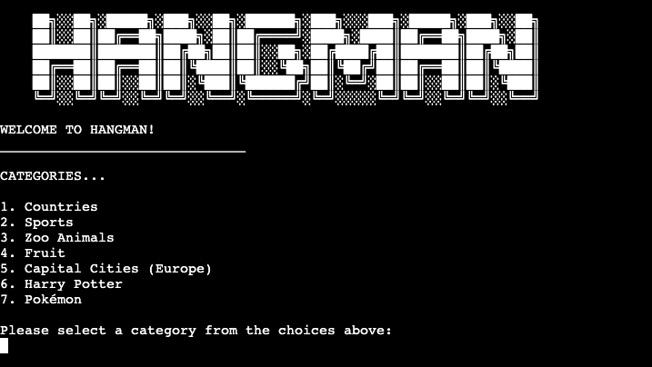

# Hangman Python Game

## Developer: Róisín O'Connell 


[View the live project here](https://hangman-roc-9218949e7f7b.herokuapp.com/)

[View GitHub repository](https://github.com/roc-11/hangman)

## Table of Contents

- [Hangman Python Game](#hangman-python-game)
  - [Developer: Róisín O'Connell](#developer-róisín-oconnell)
  - [Table of Contents](#table-of-contents)
  - [Introduction](#introduction)

***

## Introduction
Hangman is a Python-based terminal game, which runs in the [Code Institute](https://codeinstitute.net/ie/ "Link to Code Institute homepage") mock terminal on [Heroku](https://www.heroku.com/ "Link to Heroku hompepage"). This project enables users to guess letters in order to reveal the mystery word. Users can select a level of difficulty and words are categorized into different categories. Users can make up to 6 incorrect guesses. Visual feedback is provided to users via ASCII Hangman illustrations for incorrect guesses.

The game was made for the third of five Milestone Projects required to complete the Diploma in Full Stack Software Development (e-Commerce Applications) program at [Code institute](https://codeinstitute.net/ie/ "Link to Code Institute homepage").

The main requirements of this project are to build a command-line application that is useful and usable, and allows users to manage a common dataset about a particular domain.

## How To Play
Hangman is a word guessing game where a player tries to reveal a hidden word by suggesting individual letters. And incorrect guess results in a piece of a hangman figure being drawn, while correct guesses reveal the guessed letter's position. You can read more about the Hangman game in general here (LINK).

Step by step version of how to play here

## UX

### Planning Stage

#### Aim
The aim of this project is to build a Python-based Hangman game, which is fun and accessible to users, handles errors and is easy for users to navigate through the instructions. Users will play the game via a mock terminal on [Heroku](https://www.heroku.com/ "Link to Heroku hompepage").

#### Application Goals
* To provide users with a terminal-based game of Hangman which they can play.
* To produce a Python-based Hangman game which both challenges and entertains users.
* To create an environment and rules that are easily interpreted and accessible for users.
* To implement error and exception handling to provide users with useful and informative feedback, and make for a better game experience.

#### User Goals/Stories

New Users
- As a new site user, I would like to ____________, so that I can ____________.
- As a new site user, I would like to ____________, so that I can ____________.
- As a new site user, I would like to ____________, so that I can ____________.

Returning Users
- As a returning site user, I would like to ____________, so that I can ____________.
- As a returning site user, I would like to ____________, so that I can ____________.
- As a returning site user, I would like to ____________, so that I can ____________.

### User Feedback

### Flow Chart

## Features

### Main Menu

When a user launches the game, the main menu will be shown. A large ASCII Hangman Title is shown as well as some fun artwork. 
The user has 3 options to choose from on this first screen:
1. Play Game
2. Game Rules
3. Exit

User input is needed to proceed. The user can select 1, 2 or 3 and hit enter to proceed. 
The main_menu() function contains the code which deals with this initial screen. The list:

```
    valid_menu_selection = ['1', '2', '3']
```

is used to validate the user's selection. A selection entered outside of this list, e.g. 5 or "f", would result in an error message "INVALID CHOICE! Sorry, option not allowed." In this case, the user is again prompted to input a valid choice 1, 2, or 3. 


### Play Hangman

Selecting 1 from the main menu will begin the Hangman game. Three functions are run in this case:
1. get_rand_word()
2. welcome()
3. play_hangman(word)

The code will generate random word, show welcome, then play hangman. These will be further explained below. 

#### Category Selection & Generate Random, Mystery Word

The first part of playing the Hangman game involves a users being prompted to select a word category. There are 7 categories to choose from for this Hangman game. These are Countries, Sports, Zoo Animals, Fruit, Capital Cities (Europe), Harry Potter and Pokémon. 

In order to ensure a valid category is selected, there is a list: 

```
    valid_category = ["1", "2", "3", "4", "5", "6", "7"]
```

A while loop runs which prompts the user to select a category from the above list, input it and press enter. This input is stored as `category`. The while loop checks the value stored in `category`. If a valid number from the `valid_category` list is entered, the `words_list` variable is changed accordingly. There is a column for each category in `words_list` stored in the "words" sheet in Google Sheets Spreadsheets (LINK). Once a valid option is chosen, the loop is exited in order to proceed to generating a random word. 

The Python random (LINK) library is used to generate a random choice from the `words_list`. This random word is assigned to the variable `random_word`. The random word is then converted to a string with `str()` and made uppercase with `.upper()`. Finally, non-aphanumeric characters are removed from the random word string. (SEE BUGS FOR MORE DETAILS ON THIS)

```
return random word as string, remove non-alphanumeric characters

    word_to_string = str(random_word).upper()
    word_remove_non_alpha = filter(str.isalpha,word_to_string)
    word="".join(word_remove_non_alpha)

    return word
```

There is a defence included in case of an incorrect or invalid entry from the user. Anything entered which is not in the `valid_category` list will result in an error message in blue text appearing. The user will be again prompted to input a valid category selection. 

```
    elif category not in valid_category:
        print(f"{color_blue}Sorry, that is not a valid selection.")
        print(f"{color_blue}Only number 1 - 7 allowed.")
        time.sleep(2)  # delay message
        continue
```



#### Input Username

After a valid category is selected, the screen is cleared and there is a loading message, to delay all information appearing to the user at once. The time library (LINK) is imported at the top of the run.py file so that the `sleep()` function can be used throughout the game to delay/pause user feedback. 

The category the user selected is clarified. The user is then prompted to input their username. The reason for this is twofold:
* to provide a more personalised user experience (e.g. Congrats Colin!).
* initial plans included being able to save scores to Google Sheets. This turned out to be beyond the scope of this project.

The username prompt runs in a `while True:` loop. The `player_name` is returned and stored in the global variable `player_name` upon entering a valid username. 

Validation code is included here to prevent users entering 0 or an empty string. 
```
validate username
if len(player_name) == 0 or player_name == "":
    print(f"{color_blue}Sorry, you must enter a username!")
    continue
```
There is additional validation code to catch the error of a user entering a username which is non-alphabetic. 
```
elif not player_name.isalpha():
    print(f"{color_blue}Sorry, your name must be letters ONLY!")
    continue
```

The while loop runs until a valid username is entered and the user hits enter. 


#### Hangman Game Play Screen


#### Winner Screen

#### Game Over Screen

#### Play Again

### Game Rules 

### Exit Hangman

### Features to Implement in the Future

## Technologies Used

## Frameworks, Libraries & Programs Used

## Testing

## Bugs/Known Issues

## Deployment

Code Institute has provided a [template](https://github.com/Code-Institute-Org/python-essentials-template) to display the terminal view of this backend application in a modern web browser.
This is to improve the accessibility of the project to others.

The live deployed application can be found deployed on [Heroku](https://hangman-roc-9218949e7f7b.herokuapp.com).

### Heroku Deployment

This project uses [Heroku](https://www.heroku.com), a platform as a service (PaaS) that enables developers to build, run, and operate applications entirely in the cloud.

Deployment steps are as follows, after account setup:

- Select **New** in the top-right corner of your Heroku Dashboard, and select **Create new app** from the dropdown menu.
- Your app name must be unique, and then choose a region closest to you (EU or USA), and finally, select **Create App**.
- From the new app **Settings**, click **Reveal Config Vars**, and set the value of KEY to `PORT`, and the value to `8000` then select *add*.
- If using any confidential credentials, such as CREDS.JSON, then these should be pasted in the Config Variables as well.
- Further down, to support dependencies, select **Add Buildpack**.
- The order of the buildpacks is important, select `Python` first, then `Node.js` second. (if they are not in this order, you can drag them to rearrange them)

Heroku needs two additional files in order to deploy properly.

- requirements.txt
- Procfile

You can install this project's **requirements** (where applicable) using:

- `pip3 install -r requirements.txt`

If you have your own packages that have been installed, then the requirements file needs updated using:

- `pip3 freeze --local > requirements.txt`

The **Procfile** can be created with the following command:

- `echo web: node index.js > Procfile`

For Heroku deployment, follow these steps to connect your own GitHub repository to the newly created app:

Either:

- Select **Automatic Deployment** from the Heroku app.

Or:

- In the Terminal/CLI, connect to Heroku using this command: `heroku login -i`
- Set the remote for Heroku: `heroku git:remote -a app_name` (replace *app_name* with your app name)
- After performing the standard Git `add`, `commit`, and `push` to GitHub, you can now type:
	- `git push heroku main`

The frontend terminal should now be connected and deployed to Heroku!

### Local Deployment

This project can be cloned or forked in order to make a local copy on your own system.

For either method, you will need to install any applicable packages found within the *requirements.txt* file.

- `pip3 install -r requirements.txt`.

If using any confidential credentials, such as `CREDS.json` or `env.py` data, these will need to be manually added to your own newly created project as well.

#### Cloning

You can clone the repository by following these steps:

1. Go to the [GitHub repository](https://github.com/roc-11/hangman) 
2. Locate the Code button above the list of files and click it 
3. Select if you prefer to clone using HTTPS, SSH, or GitHub CLI and click the copy button to copy the URL to your clipboard
4. Open Git Bash or Terminal
5. Change the current working directory to the one where you want the cloned directory
6. In your IDE Terminal, type the following command to clone my repository:
	- `git clone https://github.com/roc-11/hangman.git`
7. Press Enter to create your local clone.

Alternatively, if using Gitpod, you can click below to create your own workspace using this repository.

[](https://gitpod.io/#https://github.com/roc-11/hangman)

Please note that in order to directly open the project in Gitpod, you need to have the browser extension installed.
A tutorial on how to do that can be found [here](https://www.gitpod.io/docs/configure/user-settings/browser-extension).

#### Forking

By forking the GitHub Repository, we make a copy of the original repository on our GitHub account to view and/or make changes without affecting the original owner's repository.
You can fork this repository by using the following steps:

1. Log in to GitHub and locate the [GitHub Repository](https://github.com/roc-11/hangman)
2. At the top of the Repository (not top of page) just above the "Settings" Button on the menu, locate the "Fork" Button.
3. Once clicked, you should now have a copy of the original repository in your own GitHub account!

## Credits

## Acknowledgements

