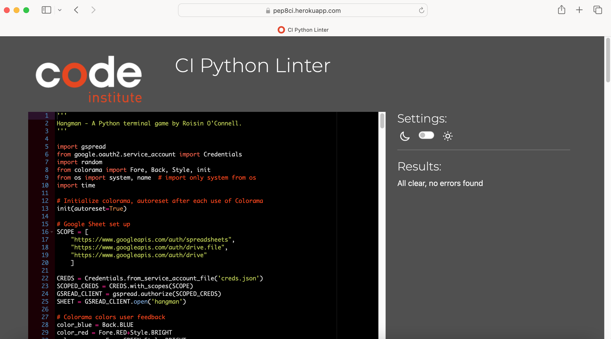
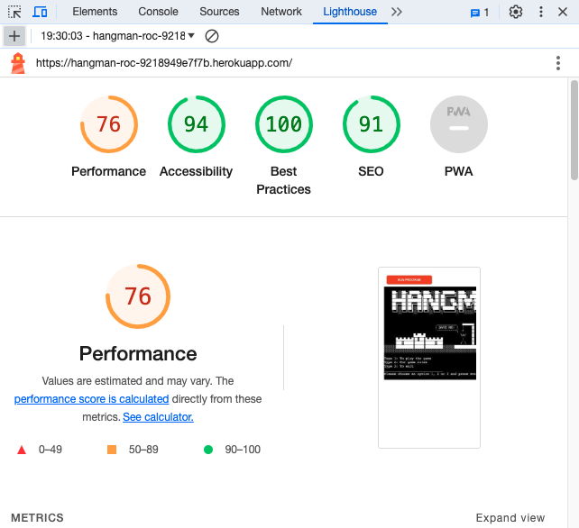
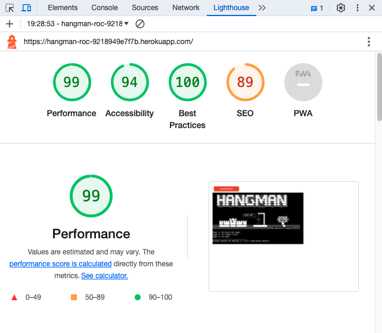
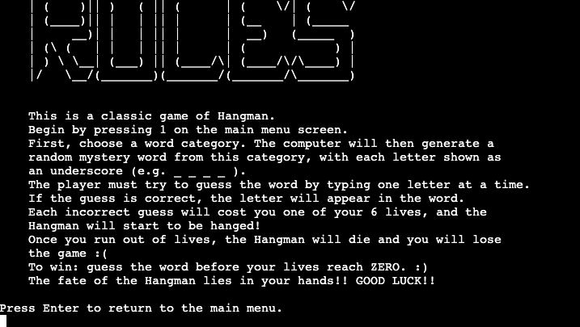
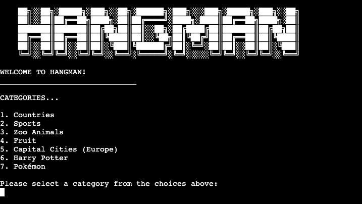
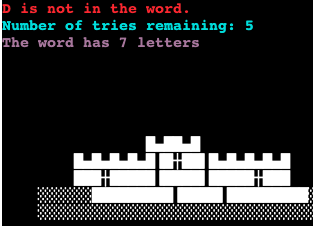
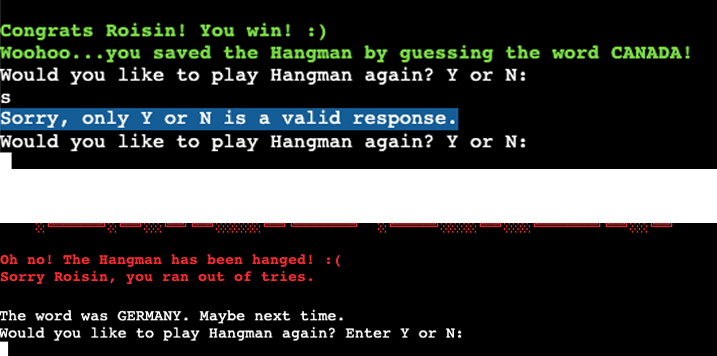
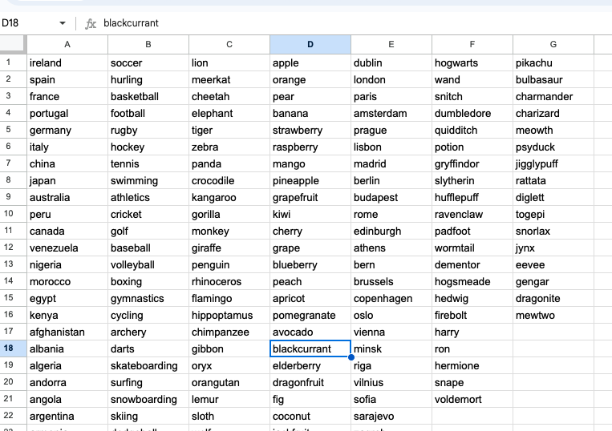

# Testing

Return back to the [README.md](README.md) file.

## Code Validation

### Python

I have used the recommended [PEP8 CI Python Linter](https://pep8ci.herokuapp.com) to validate all of my Python files.

| File | CI URL | Screenshot | Notes |
| --- | --- | --- | --- |
| run.py | [PEP8 CI](https://pep8ci.herokuapp.com/https://raw.githubusercontent.com/roc-11/hangman/main/run.py) |  | Pass: No Errors |

## Browser Compatibility

I've tested my deployed project on multiple browsers to check for compatibility issues.

| Browser | Home | About | Contact | etc | Notes |
| --- | --- | --- | --- | --- | --- |
|  |  |  |  |  | Works as expected |
|  |  |  |  |  | Works as expected |
|  |  |  |  |  | Works as expected |
|  |  |  |  |  | Minor CSS differences |

## Responsiveness

## Lighthouse Audit

I've tested my deployed project using the Lighthouse Audit tool to check for any major issues.

| Page | Mobile | Desktop | Notes |
| --- | --- | --- | --- |
| run.py |  |  | Some minor warnings |

## Defensive Programming

Defensive programming was manually tested with the below user acceptance testing:

| Page | Expectation | Test | Result | Fix | Screenshot |
| --- | --- | --- | --- | --- | --- |
| Main Menu | | | | | |
| | Feature is expected to do X when the user does Y | Tested the feature by doing Y | The feature behaved as expected, and it did Y | Test concluded and passed |  |
| | Feature is expected to do X when the user does Y | Tested the feature by doing Y | The feature did not respond to A, B, or C. | I did Z to the code because something was missing |  |
| Category Selection | | | | | |
| | Feature is expected to do X when the user does Y | Tested the feature by doing Y | The feature behaved as expected, and it did Y | Test concluded and passed |  |
| | Feature is expected to do X when the user does Y | Tested the feature by doing Y | The feature did not respond to A, B, or C. | I did Z to the code because something was missing |  |
| Username | | | | | |
| | Feature is expected to do X when the user does Y | Tested the feature by doing Y | The feature behaved as expected, and it did Y | Test concluded and passed |  |
| | Feature is expected to do X when the user does Y | Tested the feature by doing Y | The feature did not respond to A, B, or C. | I did Z to the code because something was missing |  |
| Main Game Play | | | | | |
| | Feature is expected to do X when the user does Y | Tested the feature by doing Y | The feature behaved as expected, and it did Y | Test concluded and passed |  |
| | Feature is expected to do X when the user does Y | Tested the feature by doing Y | The feature did not respond to A, B, or C. | I did Z to the code because something was missing |  |
| repeat for all remaining pages | x | x | x | x | x |

## User Story Testing

| User Story | Screenshot |
| --- | --- |
| As a new site user, I would like to read the rules/instructions, so that I can learn how to play and understand the game correctly. |  |
| As a new site user, I would like to have fun and be challenged, so that I can enjoy playing the game. |  |
| As a new site user, I would like a variety of word categories, so that I can replay the game many times. |  |
| As a new site user, I would like to know how many guesses I have left when playing, so that I can be more tactical and careful with my guesses. |  |
| As a new site user, I would like feedback after my guess, so that I can adjust my game strategy. |  |
| As a new site user, I would like to be able to play again, so that I can improve my skills. |  |
| - As a returning site user, I would like to to have fun and be challenged, so that I can enjoy playing the game. |  |
| As a returning site user, I would like to a variety of word categories, so that I can replay the games and experience new words each time I play. |  |
| As a returning site user, I would like feedback after my guess, so that I can adjust my game strategy. |  |
| As a returning site user, I would like to be able to play again, so that I can improve my skills. |  |
| As a site administrator, I should be able to add words to the Google Sheet, so that I can extend the game and implement difficulty levels in the future. |  |

## Bugs

- Python `'ModuleNotFoundError'` when trying to import module from imported package

    

    - To fix this, I _____________________.

- Python `E501 line too long` (93 > 79 characters)

    

    - To fix this, I _____________________.

- Python `E501 line too long` (whitespace error)

    

    - To fix this, I _____________________.

## Unfixed Bugs

- For PP3, when using a helper `clear()` function, any text above the height of the terminal does not clear, and remains when you scroll up.

    

    - Attempted fix: I tried to adjust the terminal size, but it only resizes the actual terminal, not the allowable area for text.

There are no remaining bugs that I am aware of.
